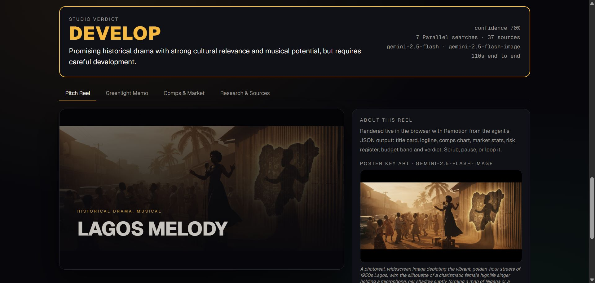
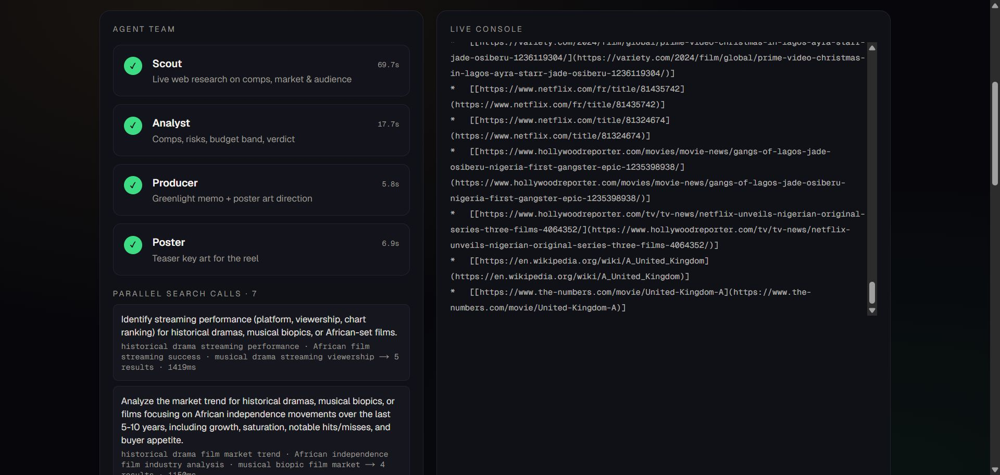

# Greenlight — the studio development-exec agent

> **Type a logline. Get a greenlight package: live-web comps research, a structured analysis, an exec memo — and a rendered pitch reel.**

Built for **Agentic Cinema: The Blockbuster Hackathon** (Google Cloud × Devpost) — **Parallel track**.

- **Live demo:** https://greenlight-206266360535.us-central1.run.app (Cloud Run, us-central1)
- **Demo video:** _YouTube — added at submission_
- **License:** MIT





---

## The problem

Every studio and streamer runs the same grind before saying yes to a project: pull comparable titles, dig up budgets and grosses, read the trades for genre trends, size the audience, band a budget, and write the memo that goes to the greenlight committee. It takes a development exec and an analyst days per pitch, and most of it is web research plus structured reasoning.

**Greenlight** does that in about 90 seconds, with citations, and ends with something a human can *watch*: a pitch reel rendered from the agent's own findings.

## What it does

```
logline ──▶ SCOUT (Gemini + Parallel Search tool) ──▶ research notes + sources
                    │
                    ▼
            ANALYST (Gemini, structured output) ──▶ comps · market · risks · budget band · verdict
                    │
                    ▼
            PRODUCER (Gemini, structured output) ──▶ greenlight memo (markdown) + poster art direction
                    │
                    ▼
            POSTER (Gemini image model / Imagen on Vertex AI) ──▶ teaser key art
                    │
                    ▼
            PITCH REEL (Remotion) ──▶ 30-second animated reel: title · logline · comps chart · market · risks · budget · verdict
```

Everything streams to the browser as it happens (Server-Sent Events): which agent is working, every Parallel search with its queries and result count, and the Scout's notes as they're written.

## Architecture

| Layer | Technology | Where in the code |
|---|---|---|
| Agent framework | **Google Agent Development Kit (ADK) for TypeScript** — `LlmAgent`, `SequentialAgent`, `FunctionTool`, `InMemoryRunner`, session state hand-off via `outputKey` | `src/lib/agents.ts`, `src/lib/pipeline.ts` |
| Models | **Gemini** (`gemini-2.5-flash` by default) via ADK; **Gemini image model / Imagen** via `@google/genai` for the poster | `src/lib/agents.ts`, `src/lib/poster.ts` |
| Web research | **Parallel Search API** (`parallel-web` SDK) wrapped as an ADK `FunctionTool` the Scout calls 4–6× per run, with `source_policy` domain focus (box-office sites vs trade press) | `src/lib/parallel.ts` |
| Structured outputs | Zod schemas → Gemini response schemas (via ADK `outputSchema`) | `src/lib/schemas.ts` |
| Pitch reel | **Remotion** composition rendered live in the browser with `@remotion/player`; MP4 export via `@remotion/renderer` | `src/remotion/`, `scripts/render.ts` |
| App | Next.js 16 (App Router) · streaming API route · Tailwind | `src/app/`, `src/components/` |
| Hosting | **Google Cloud Run** (Vertex AI / Gemini Enterprise Agent Platform for models, Secret Manager for the Parallel key) | `Dockerfile`, `deploy/deploy.sh` |

### The agent team (ADK)

- **Scout** — a research analyst. Has one tool, `parallel_search`, and an instruction to make several distinct searches (comps with budgets/grosses, streaming comps, genre trend, audience, competing projects) and write cited research notes. Output → `state.research`.
- **Analyst** — head of development. No tools, no chat history (`includeContents: "none"`); reads `state.research` + the logline and must return JSON matching `AnalysisSchema`: 4–6 comps with source URLs, three headline stats, risks with severity, a budget band, and a `GREENLIGHT / DEVELOP / PASS` verdict with confidence. Output → `state.analysis`.
- **Producer** — executive producer. Returns the greenlight memo (markdown) and art direction for the poster. Output → `state.producer`.

The three are composed as an ADK `SequentialAgent` and run by an `InMemoryRunner` in SSE streaming mode; the pipeline maps ADK events (author, function calls, partial text) to UI progress events.

### Why Parallel

Development research is *web* research: box office tables, trade-press reporting, streaming charts. Parallel's Search API returns ranked URLs with LLM-optimized excerpts in a few seconds, which is exactly what a tool-calling agent needs — compact, cited, current. The `source_policy.include_domains` option lets the Scout aim at Box Office Mojo / The Numbers / Wikipedia for hard numbers and at Variety / Deadline / THR / FlixPatrol for market signal.

## Run it locally

```bash
git clone https://github.com/AtharvaRasal/greenlight && cd greenlight
npm install
cp .env.example .env.local     # add GOOGLE_GENAI_API_KEY and PARALLEL_API_KEY
npm run dev                    # http://localhost:3000
```

- Gemini API key: https://aistudio.google.com/apikey · Parallel API key: https://platform.parallel.ai
- Poster generation needs a paid-tier Gemini key **or** Vertex AI (`GOOGLE_GENAI_USE_ENTERPRISE=1` + `gcloud auth application-default login`). Without it the run completes and the reel simply omits the poster.

CLI run (prints the event stream, saves the package to `out/`):

```bash
npm run agent:run -- "A deaf marine biologist discovers whales are singing a warning about an undersea volcano…"
```

Render an MP4 of the reel from a saved package:

```bash
npm run render -- out/run-<id>.json out/pitch-reel.mp4
```

## Deploy to Cloud Run

```bash
export GOOGLE_CLOUD_PROJECT=<project-id> PARALLEL_API_KEY=<key>
bash deploy/deploy.sh
```

The script enables the needed APIs, stores the Parallel key in Secret Manager, grants the Cloud Run service account `roles/aiplatform.user`, and deploys with `min-instances=0` so an idle service costs nothing.

## Hackathon compliance

- **Google Cloud AI only inside the product:** all reasoning and generation is Gemini (via `@google/adk` + `@google/genai`). No other vendor's models or agent frameworks are used at runtime.
- **Parallel integrated at runtime:** `parallel-web` SDK is imported in `src/lib/parallel.ts` and called by the Scout's `FunctionTool` on every run.
- **Non-AI third-party:** Remotion (video rendering framework), Next.js, Tailwind, Zod.
- New project created during the contest window; public repo; MIT license.

## Project layout

```
src/
  app/                 Next.js app (page + /api/greenlight SSE route)
  components/          GreenlightApp (UI), ReelPlayer (Remotion Player)
  lib/
    agents.ts          ADK agents: scout / analyst / producer + parallel_search tool
    pipeline.ts        runs the SequentialAgent, streams progress, assembles the package
    parallel.ts        Parallel Search API client wrapper
    poster.ts          Gemini image / Imagen poster generation
    schemas.ts         Zod schemas (structured outputs)
    types.ts           shared types
  remotion/            PitchReel composition (7 scenes), Root, sample props
scripts/               run.ts (CLI), render.ts (MP4)
deploy/                Cloud Run deploy script
```

## Author

Atharva Rasal — [Rasal Tech Solutions](https://rasaltechsolutions.com) · Built solo during Agentic Cinema, September 2026.
